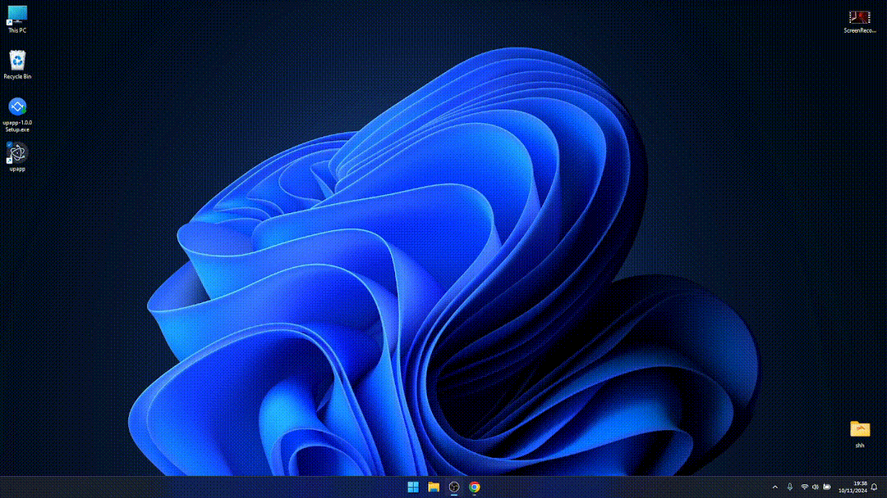

# Welcome to UpApp 

**Upload, Host, Share your files in seconds.**  
UpApp is a fast and reliable file storage client powered by a MinIO server backend, designed to simplify file management and sharing.

---

## 🚀 Installation

> **Note:**  
> This app is currently available only for **Windows x64**.

To install UpApp, visit the [releases page](https://github.com/JustArtiom/UpApp/releases) to download the latest version. Follow the instructions provided in the release notes for a smooth installation.

---

## 🎥 Recommended: Install FFMPEG

For an enhanced experience, we recommend installing FFMPEG. It enables advanced video processing features such as transcoding and compression.

### To install FFMPEG:

1. Visit the [FFMPEG installer page](https://github.com/BtbN/FFmpeg-Builds/releases).
2. Download the appropriate build for your system.
3. **Important:** Add FFMPEG to your **system environment variables** to ensure it’s accessible globally.

---

## 🎬 Demo

See UpApp in action! Watch how easily you can upload, manage, and share files with a few simple clicks:

---

## 🔧 Features

-   **Fast File Upload**: Upload your files to MinIO in a snap—no more long waits.
-   **Intuitive File Manager**: Easily browse, organize, and manage your files with just a button.
-   **Effortless Sharing**: Share files with anyone, anytime, directly from your app.
-   **Multiple Server Support**: Manage and connect to multiple servers from a single application.
-   **Reliable Hosting**: Powered by MinIO, ensuring high availability and data durability for all your files.
-   **Seamless Interface**: Clean, simple, and easy-to-navigate interface for all your file management needs.

---

## 🤖 Contribute

We welcome contributions! If you have ideas, bug fixes, or enhancements, feel free to open an issue or submit a pull request.  
Make sure to follow the contribution guidelines for a smooth process.

---

## 📄 License

UpApp is open-source and available under [this licence](LICENSE).  
Feel free to use, modify, and distribute it according to the terms of the license.

---

## 📬 Contact

For questions, suggestions, or support, don't hesitate to reach out.  
You can also follow the progress of the project on GitHub.
